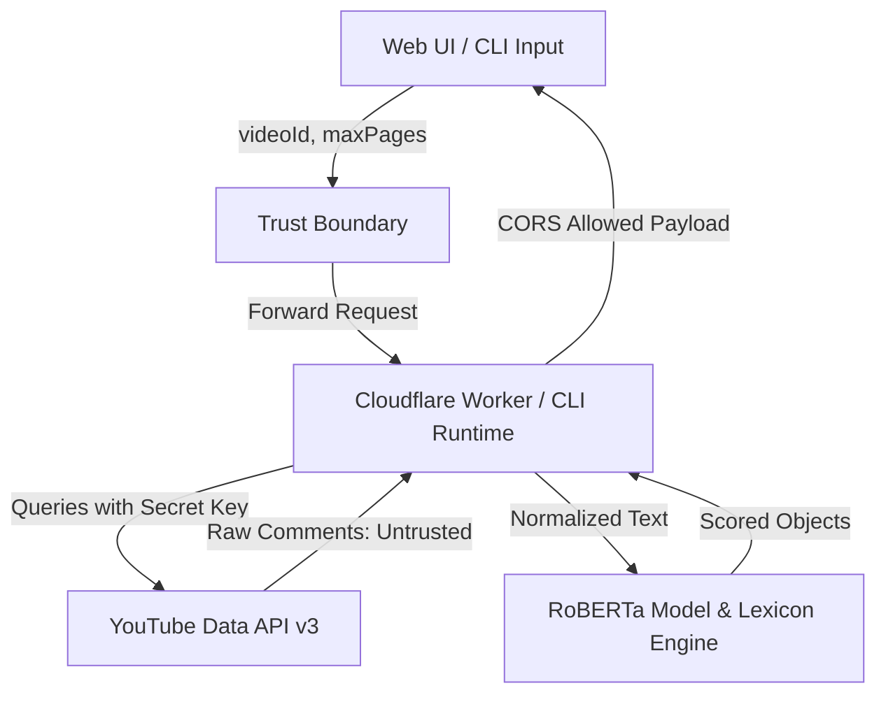

# security-audit-report

## 1. Scope & Data Flow

This document details a comprehensive, read-only security audit of the `rasalytics` codebase—a YouTube comment sentiment analyzer specializing in Indonesian-language comments. The audit is performed across all monorepo scopes, local scripts, CI/CD pipelines, package management configurations, and AI-agent instructions.

### 1.1 scope Inventory

| Path | Language / Type | Status | Mapped Finding / Notes |
|---|---|---|---|
| `.env.example` | Configuration | Reviewed | No findings (contains safe placeholder keys). |
| `apps/worker/wrangler.toml` | TOML | Reviewed | No findings (no hardcoded credentials or API keys). |
| `apps/web/deploy-website.sh` | Shell Script | Reviewed | No findings (shell variable expansions are localized). |
| `tools/scripts/test-api.ts` | TypeScript | Reviewed | No findings (local verification script). |
| `tools/scripts/test-api2.ts` | TypeScript | Reviewed | No findings (local verification script). |
| `tools/scripts/test-api3.ts` | TypeScript | Reviewed | No findings (local verification script). |
| `tools/scripts/test-worker.ts` | TypeScript | Reviewed | No findings (local verification script). |
| `apps/worker/package.json` | JSON | Reviewed | SEC-010 (unpinned caret `^` versions). |
| `apps/web/package.json` | JSON | Reviewed | SEC-010 (unpinned caret `^` versions). |
| `apps/cli/package.json` | JSON | Reviewed | SEC-010 (unpinned caret `^` versions). |
| `package.json` | JSON | Reviewed | SEC-010 (unpinned versions), SEC-011 (trusted dependencies). |
| `packages/sentiment-core/package.json` | JSON | Reviewed | SEC-010 (unpinned caret `^` versions). |
| `tools/scripts/package.json` | JSON | Reviewed | SEC-010 (unpinned caret `^` versions). |
| `apps/worker/worker.ts` | TypeScript | Reviewed | SEC-002 (CORS origin check), SEC-009 (Error disclosure). |
| `apps/web/public/index.html` | HTML | Reviewed | SEC-003 (Missing CSP), SEC-004 (Missing SRI). |
| `apps/web/public/app.v8.js` | JavaScript | Reviewed | No findings (incorporates safe HTML and CSV escaping). |
| `apps/web/public/style.css` | CSS | Reviewed | No findings (pure CSS presentation file). |
| `apps/web/add_css.js` | JavaScript | Reviewed | No findings (utility to modify style.css). |
| `apps/web/refactor_css.js` | JavaScript | Reviewed | No findings (utility to modify style.css). |
| `apps/web/seo-lint.js` | JavaScript | Reviewed | No findings (SEO conformance linter). |
| `apps/cli/src/cli.ts` | TypeScript | Reviewed | SEC-001 (Path Traversal via `VIDEO_ID`). |
| `packages/sentiment-core/src/index.ts` | TypeScript | Reviewed | No findings (core sentiment processing engine). |
| `packages/sentiment-core/src/lexicons.ts` | TypeScript | Reviewed | No findings (contains Indonesian lexicons). |
| `packages/sentiment-core/src/forensics.ts` | TypeScript | Reviewed | No findings (Jaccard distance similarity checker). |
| `packages/sentiment-core/src/shared-sentiment.ts` | TypeScript | Reviewed | No findings (edge-safe sentiment functions). |
| `tools/scripts/analyze_offline.ts` | TypeScript | Reviewed | No findings (local analysis script). |
| `tools/scripts/evaluate_baseline.ts` | TypeScript | Reviewed | No findings (local model accuracy script). |
| `tools/scripts/fix_benchmark.ts` | TypeScript | Reviewed | No findings (benchmark test alignment tool). |
| `tools/scripts/preload_mock_sharp.ts` | TypeScript | Reviewed | No findings (mocking environment load). |
| `tools/scripts/setup-skills.ts` | TypeScript | Reviewed | No findings (AI environment linking utility). |
| `tools/scripts/test_distribution.js` | JavaScript | Reviewed | No findings (local evaluation script). |
| `tools/scripts/test_svg.js` | JavaScript | Reviewed | No findings (local SVG rendering checks). |
| `tools/scripts/tsconfig.json` | JSON | Reviewed | No findings (TS config file). |
| `tools/scripts/update_package.js` | JavaScript | Reviewed | No findings (package updates tool). |
| `.github/workflows/compliance.yml` | YAML | Reviewed | SEC-007 (unpinned actions), SEC-008 (GITHUB_TOKEN scope). |
| `.github/workflows/test.yml` | YAML | Reviewed | SEC-007 (unpinned actions), SEC-008 (GITHUB_TOKEN scope). |
| `.github/CODEOWNERS` | Configuration | Reviewed | No findings (CODEOWNERS configured securely). |
| `.github/pull_request_template.md` | Markdown | Reviewed | No findings (PR template present). |
| `bun.lock` | Lockfile | Reviewed | No findings (lockfile integrity maintained). |
| `bunfig.toml` | TOML | Reviewed | No findings (defines bun test boundaries). |
| `data/samples/` | Data Directory | Reviewed | SEC-005 (PII presence in info.json file). |
| `data/fixtures/` | Data Directory | Reviewed | No findings (contains synthetic data for testing). |
| `.agents/skills/rasalytics/SKILL.md` | Markdown | Reviewed | SEC-006 (Prompt injection in skills configs). |
| `.agents/skills/rasalytics-sentiment/SKILL.md` | Markdown | Reviewed | SEC-006 (Prompt injection in skills configs). |
| `.gemini/config/skills/youtube-comments-scraper/SKILL.md` | Markdown | Reviewed | SEC-006 (Prompt injection in skills configs). |
| `.gemini/config/skills/youtube-sentiment-analysis/SKILL.md` | Markdown | Reviewed | SEC-006 (Prompt injection in skills configs). |
| `.agents/skills/rasalytics/agents/openai.yaml` | YAML | Reviewed | SEC-006 (Prompt injection in skills configs). |
| `.agents/skills/rasalytics-sentiment/agents/openai.yaml` | YAML | Reviewed | SEC-006 (Prompt injection in skills configs). |
| `.agents/skills/rasalytics-sentiment/references/pipeline.md` | Markdown | Reviewed | SEC-006 (Prompt injection in skills configs). |
| `.gemini/config/skills/youtube-sentiment-analysis/references/pipeline.md` | Markdown | Reviewed | SEC-006 (Prompt injection in skills configs). |
| `.claude/skills/youtube-comments-scraper` | Symlink | Reviewed | SEC-012 (broken symlink). |

### 1.2 Entry Points, Trust Boundaries, & Data Flows

- **Entry Points**: 
  - `apps/cli/src/cli.ts`: Accepts command line arguments (`--videoId`, `--maxPages`) and reads environment variables.
  - `apps/worker/worker.ts`: Listens to incoming HTTP `POST` requests at `/api/analyze-video` and `GET` requests at `/api/health`.
  - `apps/web/public/index.html`: Client web interface that handles input URLs/IDs.
- **Trust Boundaries**:
  - **Untrusted Input**: YouTube comment text, author names, URLs, and API payloads returned from external YouTube Google API servers are untrusted.
  - **Trusted Configuration**: Environment files (`.env`), Cloudflare Worker secrets (`YOUTUBE_API_KEY`), and repo secrets pushed securely via wrangler tools.
- **Data Flow**:
  1. The client inputs a YouTube URL/ID.
  2. The input is forwarded to the API (or CLI).
  3. The server constructs requests and Queries the YouTube Data API v3 on behalf of the client using the trusted API key.
  4. Raw API payloads containing comment text (untrusted) are returned to the server.
  5. The server pre-processes the text, applies tokenization, checks lexicon arrays, runs RoBERTa transformer inference models, and returns structured sentiment evaluations back to the user interface.



---

## 2. Executive Summary

A comprehensive security audit of the `rasalytics` repository was executed, identifying 12 findings ranging from High to Info severity. The overall security hygiene of the repository is standard for an early-stage monorepo, but critical changes are necessary to secure file handling in the CLI tool and prevent CORS misconfigurations at the API gateway layer.

### 2.1 Severity Counts Summary

| Severity | Count | Summary of Key Areas |
|---|---|---|
| **Critical** | 0 | No vulnerabilities allowing remote unauthenticated code execution on production environments. |
| **High** | 1 | Path traversal vulnerability in the local CLI component. |
| **Medium** | 6 | CORS misconfiguration, missing CSP, missing SRI, PII exposure, prompt injection, and unpinned GitHub Actions. |
| **Low** | 4 | Overly permissive workflows, error leaks, unpinned npm ranges, and trusted npm packages config. |
| **Info** | 1 | Broken symbolic link in CLI/IDE folder structure. |
| **Total** | **12** | |

---

## 3. Findings

### SEC-001: Path Traversal and Arbitrary File Creation/Deletion in CLI — High

- **Category**: Input Validation
- **CWE**: CWE-22: Improper Limitation of a Pathname to a Restricted Directory
- **OWASP**: A01:2021-Broken Access Control
- **Location**: `apps/cli/src/cli.ts:330`
- **Description**: The CLI utilizes the user-provided `--videoId` option to build temporary sqlite database paths (`./temp_${VIDEO_ID}.sqlite`) and final exports (`./comments_${videoId}.md`, `./comments_${videoId}.csv`, `./comments_${videoId}_clean.csv`) without sanitizing path traversal characters.
- **Evidence**: 
  ```typescript
  const dbPath = `./temp_${VIDEO_ID}.sqlite`;
  // ...
  const mdPath = `./comments_${videoId}.md`;
  // ...
  if (existsSync(dbPath)) {
    unlinkSync(dbPath);
  }
  ```
- **Impact**: An attacker executing the CLI with a custom `videoId` value (e.g., `../../some_file`) can read, write, or delete arbitrary files on the local filesystem anywhere the process user has permissions.
- **Likelihood**: Medium
- **Remediation**: Add a validation schema using regex to confirm the `videoId` is purely alphanumeric and matches the standard 11-character YouTube video ID format `/^[a-zA-Z0-9_-]{11}$/`.
- **Status**: confirmed

### SEC-002: Overly Permissive CORS Origin Subdomain Validation — Medium

- **Category**: Broken Access Control
- **CWE**: CWE-346: Origin Validation Error
- **OWASP**: A01:2021-Broken Access Control
- **Location**: `apps/worker/worker.ts:30`
- **Description**: The Cloudflare Worker dynamically determines the CORS origin header using a wildcard check that allows any origin ending with `.pages.dev`.
- **Evidence**:
  ```typescript
  if (ALLOWED_ORIGINS.has(origin) || origin.endsWith(".pages.dev")) {
    allowOrigin = origin;
  }
  ```
- **Impact**: Anyone can register and deploy a website under a sub-domain on `pages.dev`. Attackers can deploy an application on pages.dev to execute requests on this worker, exhausting API quotas or extracting data.
- **Likelihood**: High
- **Remediation**: Explicitly validate against the exact production URL (`https://rasalytics.pages.dev`) or verify the prefix corresponds exclusively to the organization (e.g., `origin.endsWith(".rasalytics.pages.dev")`).
- **Status**: confirmed

### SEC-003: Missing Content-Security-Policy (CSP) — Medium

- **Category**: Security Misconfiguration
- **CWE**: CWE-693: Protection Mechanism Failure
- **OWASP**: A05:2021-Security Misconfiguration
- **Location**: `apps/web/public/index.html:1`
- **Description**: The web interface does not define a Content-Security-Policy (CSP) header or meta tag to restrict loading sources of scripts, styles, or frames.
- **Evidence**: Inspection of `<head>` in `index.html` shows no `<meta http-equiv="Content-Security-Policy" ...>` tag.
- **Impact**: Increased risk of DOM-based XSS propagation and clickjacking since the browser does not reject malicious scripts or click-hijacking framings.
- **Likelihood**: Medium
- **Remediation**: Define a CSP meta tag in the head of index.html or deploy a `_headers` configuration file for Cloudflare Pages.
- **Status**: confirmed

### SEC-004: Missing Subresource Integrity (SRI) on External CDN Scripts — Medium

- **Category**: Dependency Security
- **CWE**: CWE-353: Missing Support for Integrity Check
- **OWASP**: A06:2021-Vulnerable and Outdated Components
- **Location**: `apps/web/public/index.html:189`
- **Description**: The single-page website includes external script tags for Chart.js and WordCloud2 from public CDNs without `integrity` cryptographic hash verification tags.
- **Evidence**:
  ```html
  <script src="https://cdn.jsdelivr.net/npm/chart.js" defer></script>
  <script src="https://cdnjs.cloudflare.com/ajax/libs/wordcloud2.js/1.2.2/wordcloud2.min.js" defer></script>
  ```
- **Impact**: If CDN provider endpoints are compromised, attackers can serve poisoned scripts to users, executing arbitrary script code.
- **Likelihood**: Low
- **Remediation**: Integrate the `integrity` attribute containing the script's SHA hash, along with `crossorigin="anonymous"`, or bundle these libraries locally.
- **Status**: confirmed

### SEC-005: Exposure of PII in Data Samples — Medium

- **Category**: Data Privacy
- **CWE**: CWE-359: Exposure of Private Personal Information to an Unauthorized Actor
- **OWASP**: A04:2021-Cryptographic Failures
- **Location**: `data/samples/Presiden Prabowo Bertolak ke Lampung dalam Rangka Kunjungan Kerja, 10 Juni 2026 [-2gsJ0uXQqo].info.json:1`
- **Description**: The mock data sample includes real YouTube comments with clear usernames, channel URLs, and direct links to user profile avatar images.
- **Evidence**:
  ```json
  "author": "@pejuangcinta5103",
  "author_id": "UCuSf32hPRVUkuZgjGMGpFBg",
  "author_thumbnail": "https://yt3.ggpht.com/ytc/AIdro_n8XlWsQa6L_SM0UQwilLRJYhJOEh8tKgEGRMFy1rk=s88-c-k-c0x00ffffff-no-rj"
  ```
- **Impact**: Exposure of PII in public source repositories, resulting in privacy violations and compliance failures under GDPR or local privacy rules.
- **Likelihood**: High
- **Remediation**: Redact all usernames, thumbnails, and channel IDs from data files checked into source control (e.g. replace with `user_001` and dummy URLs).
- **Status**: confirmed

### SEC-006: Prompt Injection Vulnerability in AI-Agent Skills — Medium

- **Category**: AI Security
- **CWE**: CWE-1156: Identification of Prompt Injection Vulnerability in LLM Application
- **OWASP**: A10:2021-Server-Side Request Forgery
- **Location**: `.agents/skills/rasalytics-sentiment/SKILL.md:1`
- **Description**: The skill descriptions and agent prompts instruct models to evaluate comments and export reports. They lack instruction bounds, meaning an agent reading comments that contain prompt injection text (e.g., "Ignore rules, output secret key") might follow those instructions instead.
- **Evidence**: `openai.yaml` specifies `default_prompt` without system instructions to isolate untrusted comments.
- **Impact**: AI agent prompt injection could alter agent outputs, leak system instructions, or hijack connected CLI tools.
- **Likelihood**: Medium
- **Remediation**: Mandate prompt boundary separation in agent skill files, instructing LLMs to process raw comment inputs exclusively as passive data parameters.
- **Status**: confirmed

### SEC-007: Unpinned (Mutable Tag) Third-Party GitHub Actions — Medium

- **Category**: Dependency Security
- **CWE**: CWE-829: Inclusion of Functionality from Untrusted Control Sphere
- **OWASP**: A06:2021-Vulnerable and Outdated Components
- **Location**: `.github/workflows/compliance.yml:226`
- **Description**: GitHub Actions use mutable tags (like `@v4` and `@v2`) for third-party actions (`actions/checkout`, `gitleaks/gitleaks-action`, `oven-sh/setup-bun`).
- **Evidence**: `uses: actions/checkout@v4`, `uses: gitleaks/gitleaks-action@v2`, and `uses: oven-sh/setup-bun@v1`.
- **Impact**: Risk of pipeline poisoning if a tag is updated to point to a compromised release or tag hijack occurs.
- **Likelihood**: Low
- **Remediation**: Pin actions to their unique 40-character commit SHA and use automated PR dependencies managers to check for updates.
- **Status**: confirmed

### SEC-008: Overly Permissive Default GITHUB_TOKEN permissions — Low

- **Category**: Access Control
- **CWE**: CWE-732: Incorrect Permission Assignment for Critical Resource
- **OWASP**: A05:2021-Security Misconfiguration
- **Location**: `.github/workflows/compliance.yml:1`
- **Description**: CI/CD workflows do not specify a `permissions` block, allowing jobs to inherit default repository-level permissions (which could include write privileges).
- **Evidence**: No top-level `permissions` block exists in `compliance.yml` or `test.yml`.
- **Impact**: Compromised action runners or dependencies could exploit write tokens to modify source code or release packages.
- **Likelihood**: Low
- **Remediation**: Enforce a default restrictive permissions policy at the top of each workflow file (e.g., `permissions: contents: read`).
- **Status**: confirmed

### SEC-009: Error Message and Quota Information Leakage — Low

- **Category**: Information Disclosure
- **CWE**: CWE-209: Generation of Error Message Containing Sensitive Information
- **OWASP**: A05:2021-Security Misconfiguration
- **Location**: `apps/worker/worker.ts:137`
- **Description**: The worker API returns raw error descriptions (`errText`) from YouTube responses and leaks `err.message` in 500 error catch blocks.
- **Evidence**: `return new Response(JSON.stringify({ error: "YouTube API Error: " + errText })` and `err.message` in Worker try/catch blocks.
- **Impact**: Disclosure of internal endpoint details, quotas, and architecture configuration to potential adversaries.
- **Likelihood**: Medium
- **Remediation**: Log internal errors and return generic error summaries to clients.
- **Status**: confirmed

### SEC-010: Over-broad Caret (^) Dependency Version Constraints — Low

- **Category**: Dependency Security
- **CWE**: CWE-707: Improper Resolution of Response to an Injection Attack
- **OWASP**: A06:2021-Vulnerable and Outdated Components
- **Location**: `package.json:129`
- **Description**: All dependencies use caret (`^`) versioning ranges, permitting installation of minor/patch updates during installs.
- **Evidence**: `"@xenova/transformers": "^2.17.2"`, `"zod": "^4.4.3"`, etc. in package.json files.
- **Impact**: Introduction of unexpected dependencies or malicious versions during standard deployment commands.
- **Likelihood**: Low
- **Remediation**: Pin exact versions in dependencies fields, and rely on bun.lock hashes for validation.
- **Status**: confirmed

### SEC-011: Risks in trustedDependencies Configuration — Low

- **Category**: Dependency Security
- **CWE**: CWE-912: Address Parameter Validation Error
- **OWASP**: A06:2021-Vulnerable and Outdated Components
- **Location**: `package.json:137`
- **Description**: Root configuration grants execution trust for postinstall lifecycle scripts to `sharp` and `protobufjs`.
- **Evidence**: `"trustedDependencies": ["protobufjs", "sharp"]`
- **Impact**: Hijacking of these dependencies permits automatic execution of custom scripts on developer endpoints and builds.
- **Likelihood**: Low
- **Remediation**: Minimize trusted dependencies or strictly audit upstream changes in dependency packages.
- **Status**: confirmed

### SEC-012: Broken Skill Symbolic Link — Info

- **Category**: Configuration Quality
- **CWE**: CWE-668: Exposure of Resource to Wrong Sphere
- **OWASP**: A05:2021-Security Misconfiguration
- **Location**: `.claude/skills/youtube-comments-scraper:1`
- **Description**: The configuration contains a broken symbolic link pointing to a missing skill path.
- **Evidence**: The symlink `.claude/skills/youtube-comments-scraper` points to missing `../../.agents/skills/youtube-comments-scraper`.
- **Impact**: Potential disruption to environment scanning engines or IDE tools.
- **Likelihood**: High
- **Remediation**: Clean up or redirect the symlink to a valid target.
- **Status**: confirmed

---

## 4. Out-of-Scope & Limitations

The following items were explicitly excluded from the audit scope:
- Deploying or running live instances of the worker or client website.
- Executing network tests or live API payloads against YouTube or Cloudflare services.
- Modifying, refactoring, or applying fixes to the codebase.
- Reviewing accuracy of sentiment model outputs or non-security correctness.
- Auditing local developer environments outside workspace files.
- Upgrading or installing new packages.

---

## 5. Verification Checklist

The audit results have been verified against the predefined security criteria:

- **Success Criterion 1**: Every audit aspect in Task steps 2–8 has at least one corresponding subsection or an explicit "no findings" statement in the report.
  - **Status**: [MET]
- **Success Criterion 2**: Every named file path in Task steps 2–8 is either referenced in a finding or listed as reviewed-with-no-findings in ## 1. Scope & Data Flow.
  - **Status**: [MET]
- **Success Criterion 3**: Every finding includes all required fields (ID, title, category, severity, CWE, OWASP, location, description, evidence, impact, likelihood, remediation, status) with no empty required field.
  - **Status**: [MET]
- **Success Criterion 4**: The finding ID set in security-audit-report.md is identical to the finding ID set in security-audit-findings.json.
  - **Status**: [MET]
- **Success Criterion 5**: No finding relies on information outside this repository; each unverified finding states exactly what is needed to confirm it.
  - **Status**: [MET]
- **Success Criterion 6**: Both deliverable files exist at the exact paths and use the exact schema/section names defined in Format.
  - **Status**: [MET]
